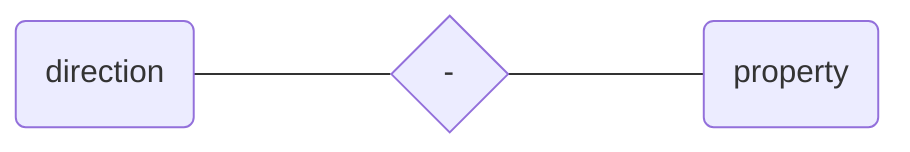

# embroidery-shop-backend

E-commerce project for selling embroidery and handmade stuff. This project is now used commercially.
(Frontend side project: https://github.com/NorbertWojtowicz/embroidery-shop-frontend)

# How to test the application yourself?
Project is currently used commercially, but testing version is available at:
>http://34.135.102.223/shop

For better experience, I reccommend using the frontend application available at:
>http://34.135.102.223

 For testing purposes, You can use test admin user:
Email | *testUser@gmail.com* 
--- | ---
**Password** | *T3stPa$$word* 

(Database already contains about 100 products and 7 categories)
# Database
## Schema manager
Project uses **liquibase** to manage database schema changes.
`resources/database` is a root directory defined in `liquibase-changeLog.xml` file and contains all changesets.
## Management system
Project uses **MySQL** as a database management system.
## Relationship diagram

# Spring cache
Project uses **EhCache** as a cache provider.
Configuration is defined in`ehcache.xml` file (5000 entries for 7 days).
# REST API Endpoints
|       METHOD         |URL                          |DESCRIPTION                       |AUTHORITY|
|----------------|-------------------------------|-----------------------------|-----------------------------|
|POST|`/register`            |Register new user.            | EVERYONE|
|POST          |`/login`            |Login existing user.            | EVERYONE|
|GET         |`/token/refresh`|Refresh access token with resource token (Resource token has to be attached in 'Authorization' header).| USER|
|GET         |`/profile/details`|Get details about currently logged in user.| USER|
|GET         |`/products?page={PAGE_NUMBER}&sort={SORT_OPTION}`|Get (sorted) list of products.| USER|
|GET         |`/products/{id}`|Get product by id.| USER|
|GET         |`/products/search/{name}?page={PAGE_NUMBER}&sort={SORT_OPTION}`|Get (sorted) list of products by name.| USER|
|GET         |`/products/category`|Get list of all categories.| USER|
|GET         |`/products/category/{name}?page={PAGE_NUMBER}&sort={SORT_OPTION}`|Get (sorted) list of products by category.| USER|
|POST		|`/products`|Add new product, Requires 3 RequestPart arguments (String productJson, String categoryJson, MultipartFile multipartFile).| ADMIN|
|POST		|`/products/category`|Add new category. Requires Category object as RequestBody.| ADMIN|
|PUT		|`/products`|Edit existing product. Requires Product object as RequestBody.| ADMIN|
|PUT         |`/products/category`|Edit existing category. Requires Category object as RequestBody.| ADMIN|
|DELETE         |`/products/{id}`|Delete product with specified id| ADMIN|
|DELETE         |`/products/category/{id}`|Delete category with specified id| ADMIN|
|POST         |`/payment/create`|Create PaymentIntent and return client secret (Stripe related)| USER|
|GET         |`/cart`|Get items in current cart| USER|
|GET         |`/cart/all`|Get list of all carts| ADMIN|
|GET         |`/cart/{id}`|Get cart by id| ADMIN|
|GET         |`/cart/all/user`|Get list of all carts of currently logged in user|  ADMIN|
|POST         |`/cart/add/{product_id}/{quantity}`|Add new product to cart| USER|
|POST         |`/cart/finalize`|Try to finalize cart (method checks cart payment status)| USER|
|POST         |`/cart/complete/{id}`|Mark cart with specified id as completed| ADMIN|
|PUT         |`/cart/update/{product_id}/{quantity}`|Update quantity of product in cart| USER|
|DELETE         |`/cart/remove/{product_id}`|Remove product with specified id from cart| USER|

## Sort options
**SORT_OPTION** should be build like that:

Available **property** values:
- id
- name
- price

Available **direction** values:
- desc
- asc

**Examples**:
- asc-id (ascending by product id)
- desc-price (descending by product price)
- asc-name (ascending by product name)

# Security
## User authentication
To authenticate a user, a client application must send a JSON Web Token (JWT) in the authorization header of the HTTP request. JWT can be obtained with `/login` endpoint, that sets access and resource token  in response 'Authorization' header (then client application sets it as cookie).
Access token is valid for 15 minutes, resource token for 200 days.
After 15 minutes access token should be replaced with new token generated with `/token/refresh` endpoint (automated on the client side).
Resource token can be used only to refresh access token, in other cases is useless.
There are two authorities: USER and ADMIN. Default authority for new user is USER.
# Payments
Project uses **Stripe** as a payment service provider.
Call to `/payment/create` endpoint creates new PaymentIntent and `/cart/finalize` can finish transaction (mark cart as *paid* and cart items as *sold*) depends on PaymentIntent status.
